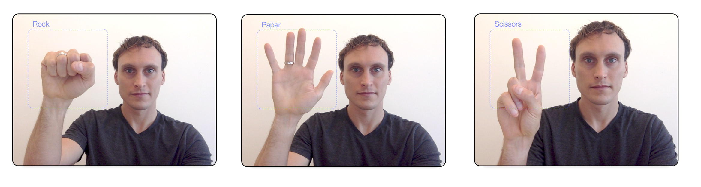

# Rock Paper Scissors Webcam
This is a project to create a deep learning-based prediction model for real-time predicting "Rock" "Paper" or "Scissors" within a browser's webcam stream.  

To interact a live version, visit: https://www.donbonjenbi.com



It uses tensorflow.keras for model training, and tensorflowjs for model deployment.  

**The model consists of:**
- A MobileNetV2 backbone, starting with weights pre-trained on imagenet (https://www.tensorflow.org/api_docs/python/tf/keras/applications/MobileNetV2)
- With the head replaced with our custom output layers 
- With the weights re-trained on our custom dataset (/model_training/datasets/donbonjenbi_RPS_dataset2)
- and finally converted from keras_model => tfjs for compression & final deployment


**The deployment package uses:**
- Flask for the webframework & URL routing (https://flask.palletsprojects.com/en/1.1.x/)
- OpenCv.js for image preprocessing (https://docs.opencv.org/3.4/d5/d10/tutorial_js_root.html)
- tensorflowjs for model deployment (https://www.tensorflow.org/js)
- `RPS_webcam_js/RPS_webcam/static/script.js` for processing the webcam stream & parsing the predictions


## To train a model
- start your virtualenv
- navigate to the `/model_training` directory
```
cd model_training
```
- install required packages with pip: 
```
pip install -r requirements.txt
```
- Set the necessary variables for training, within ```model_training/train_model.py```
```
[...]

# Loading the data:  
# 	if DATA_SOURCE is 'tfds' => downloads the official tfds dataset.  
# 	if DATA_SOURCE is 'local_folder' => uses dataset contained in LOCAL_DATASET_DIR
DATA_SOURCE = 'tfds'  
LOCAL_DATASET_DIR = 'datasets/donbonjenbi_RPS_dataset2'
CLASS_NAMES = ['rock','paper','scissors','none'] # only grabs from folders that match these names
REFRESH_DATASET = False 		# set this to true for the first run colab. it will load a local copy of the training data from G-drive to local folder before running training.  

# Training hyperparameters
LR_FIRST_ROUND = 0.0001 		# typically 0.0001
EPOCHS_FIRST_ROUND = 1 			# typically 10, reduce to 1 for initial test
LR_SECOND_ROUND = 0.000005  	# typically 0.000001 to 0.000005
EPOCHS_SECOND_ROUND = 1 		# typically 200, reduce to 1 for initial test
EARLY_STOPPING_PATIENCE = 6

# Saving the model
MODEL_NAME = 'RockPaperScissors_model' 
MODEL_VERSION = 1  				# version_num to use while saving the new model

[...]
```
- run training:
```
python train_model.py
```


## To deploy the code & run on your local host
- Either use the default model contained in `/RPS_webcam_js/RPS_webcam/static/models`, or replace the model files with a new version.  
- start your virtualenv
- navigate to the `/RPS_webcam_js` directory:  
```
cd RPS_webcam_js
```
- install required packages with pip: 
```
pip install -r requirements.txt
```
- start the flask server: 
```
python3 main.py
```
- once the server is running, open port 8080 of the localhost in your web browser of choice to view it.  
```
127.0.0.1:8080
```
or
```
localhost:8080
```

## Enjoy! 
